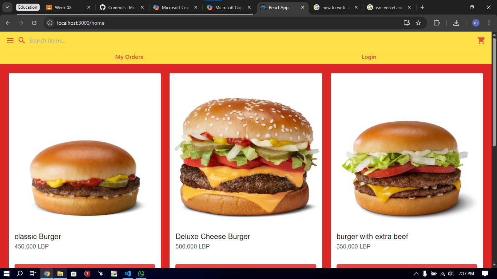
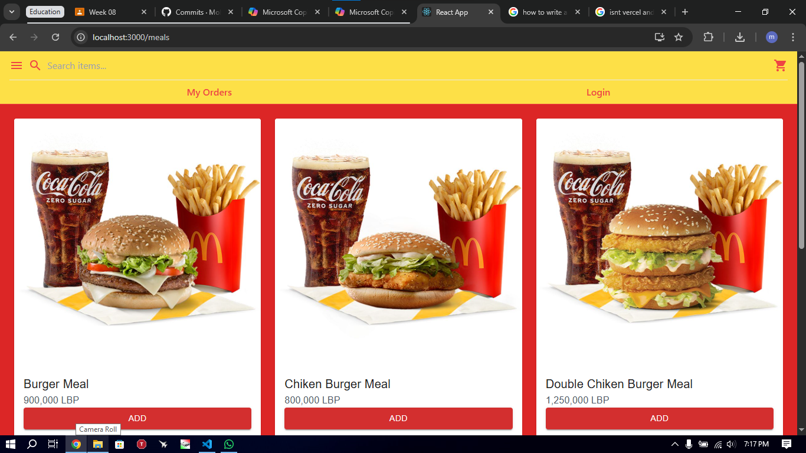
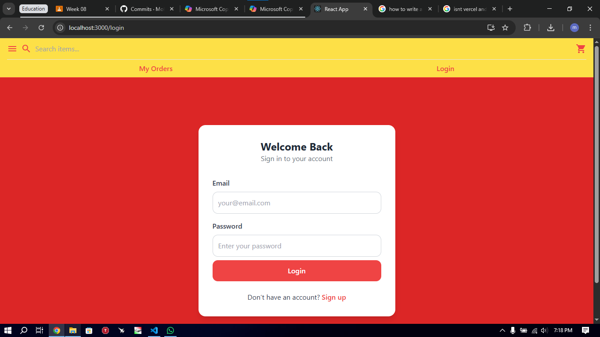
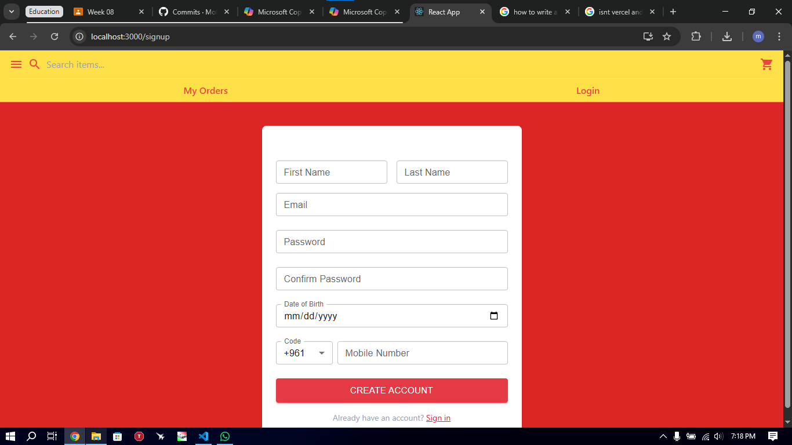
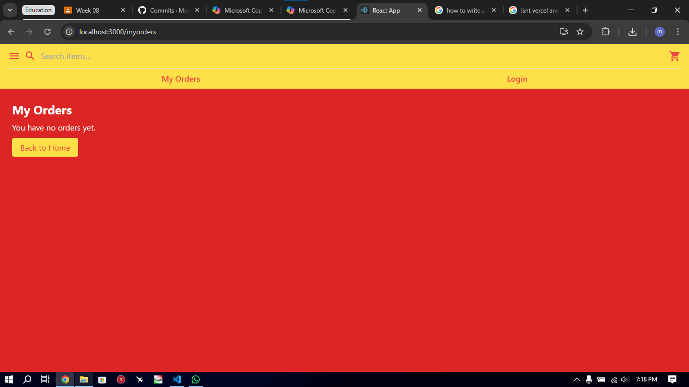
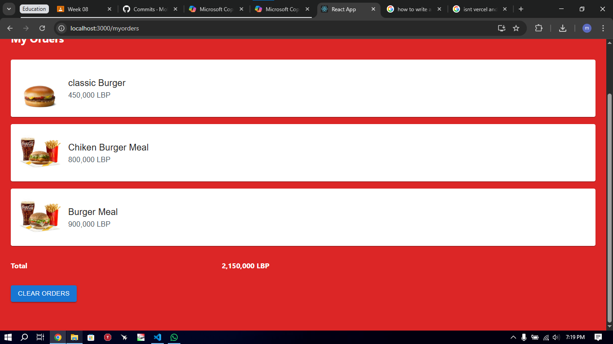
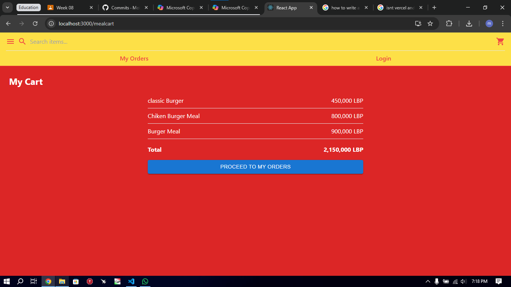
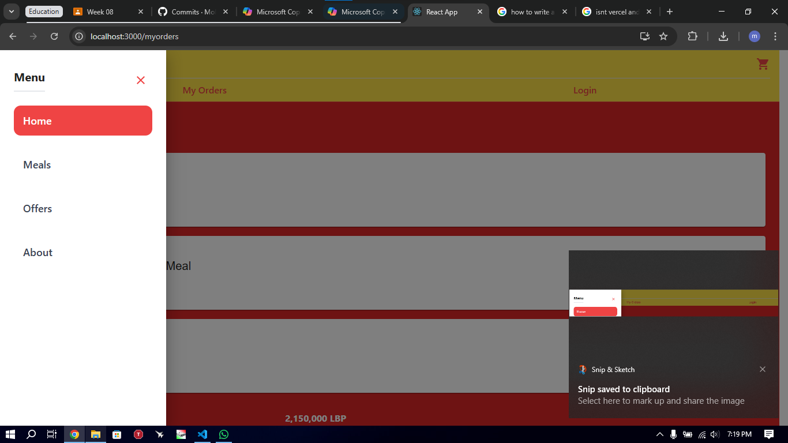

Links:
    1.https://github.com/Mohamad-Boustani/menucraft
    2.https://menucraft123.vercel.app

A.Contributers:

Mohamad El Boustani 

Amer Osta

B.Installed libraries:

    1. Tailwindcss v3.4.18

    2. Material UI v7.3.5
    
    3. Sweet Alert 2 v11.26.3

    4. toastify v11.0.5

C.Website Description:

Its a website for ordering fastfood;
It has login/signup page; Small orders page; Big order page
(Under Creating)Offers page;

D.Usage info:

    1. Login to the page if you have an account if you don't crate an account(!Make sure you fill all the necessary information)
    2. Choose what you want from the available food, it will take you to the cart page then add the order that will take you then to the "My order" page
    3. If you want to check how much you need to pay go to the cart page
    4. For navigation between the pages use the Sidebar
    5. If you want to clear your orders there is a clear button in the page 
    
E.Project structure

- `src/App.js` — application routes and main layout
- `src/components/Navbar.jsx` — top navigation component
- `src/components/Sidebar.jsx` — side drawer navigation (uses MUI Drawer)
- `src/pages/Home.jsx` — main product listing (uses images in `src/assets`)
- `src/pages/About.jsx` — about page
- `src/pages/Meals.jsx`, `src/pages/Mealcart.jsx`, `src/pages/Myorders.jsx`, `src/pages/Offers.jsx` — feature pages

F.Website Screenshot images:

- Home — Desktop:

    

- Meals:

    

- Login / Signup:

    

    

- My Orders / Offers:

    

    

    

    

    

